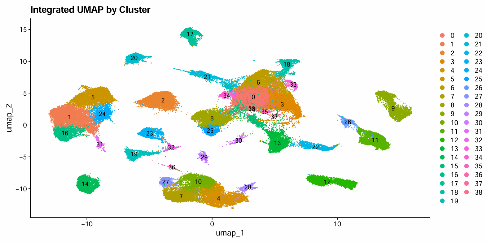
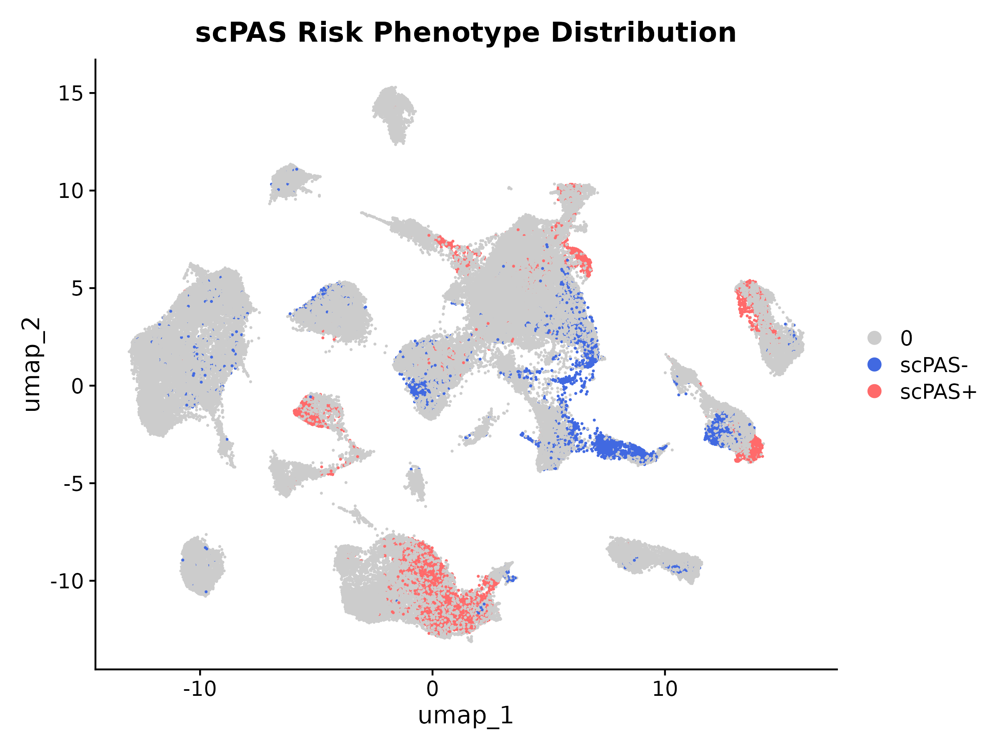
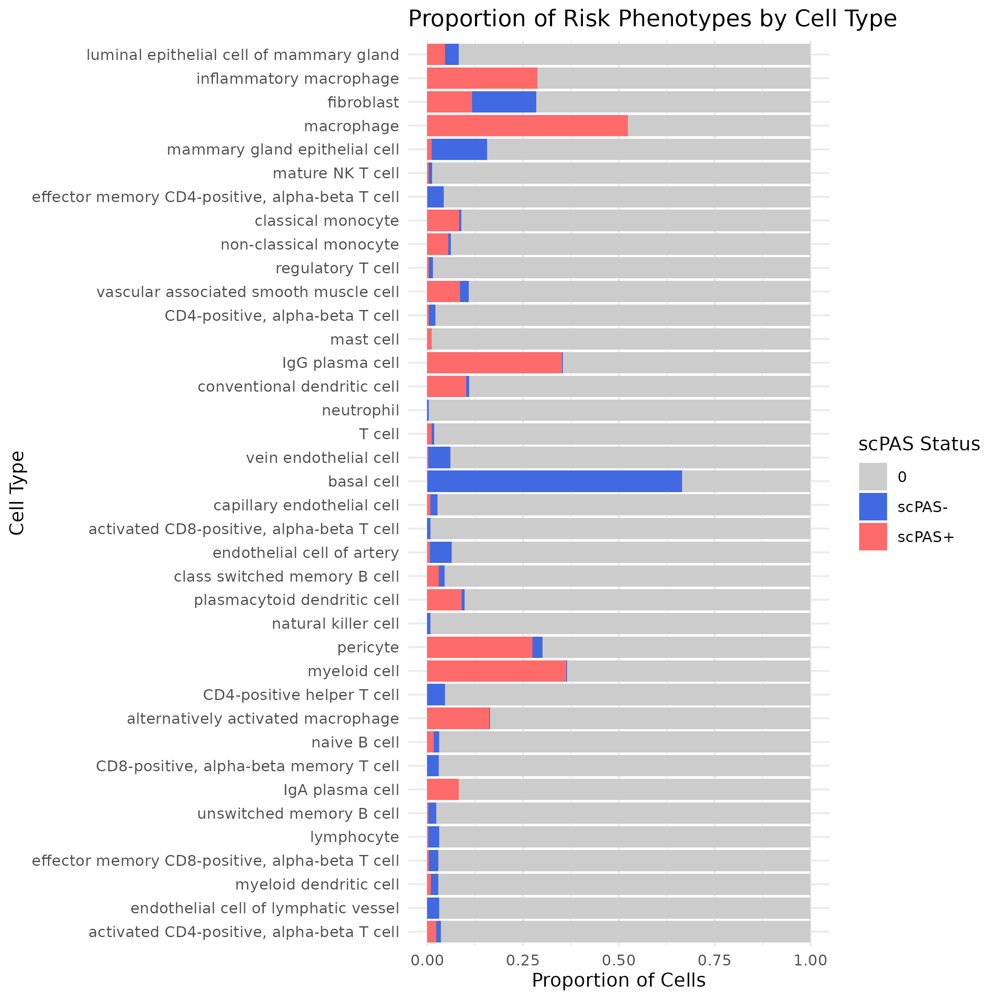
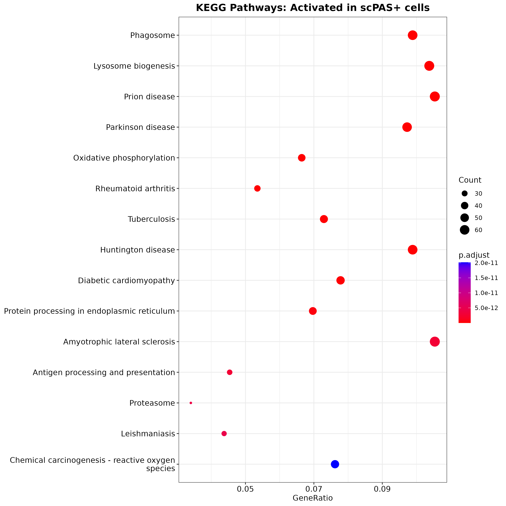

# 🧬 Breast Cancer scRNA-seq & Drug Repurposing Pipeline

**Title:** Targeting High-Risk Macrophage Phenotypes in the Breast Cancer Microenvironment: A Single-Cell Transcriptomic and Drug Repurposing Analysis

This repository contains the complete computational pipeline for analyzing single-cell RNA sequencing (scRNA-seq) data from the breast cancer tumor microenvironment (TME). By integrating unsupervised machine-learning survival models with dual *in silico* drug repurposing algorithms, this workflow unmasks high-risk cellular subpopulations and identifies targeted therapies capable of reversing their prognostic signatures.

---

## 📌 Key Findings

* **The Primary Culprit:** A specific subpopulation of tumor-associated macrophages (TAMs) drives poor clinical outcomes, with >52% of annotated macrophages exhibiting a high-risk (`scPAS+`) survival signature.
* **The Biological Mechanism:** These high-risk macrophages are hyper-metabolic and motile. They rely heavily on Oxidative Phosphorylation (OXPHOS) and are actively engaged in antigen presentation, phagocytosis, and chemotaxis to orchestrate an immunosuppressive ecosystem.
* **The Treatment Strategy:** Dual *in silico* drug repurposing (DrugReSC & ASGARD) identified that this aggressive transcriptomic state can be therapeutically reversed using **targeted kinase inhibitors** (e.g., Dabrafenib, Vemurafenib, Imatinib) and **proteasome inhibitors** (e.g., Ixazomib).

---

## 📊 Visual Highlights

<p align="center">
  <table>
    <tr>
      <td align="center"><b>TME Integration & Clustering</b></td>
      <td align="center"><b>scPAS Risk Phenotype Distribution</b></td>
    </tr>
    <tr>
      <td></td>
      <td></td>
    </tr>
    <tr>
      <td align="center"><b>Risk Proportion by Cell Type</b></td>
      <td align="center"><b>KEGG Pathway Activation (scPAS+)</b></td>
    </tr>
    <tr>
      <td></td>
      <td></td>
    </tr>
  </table>
</p>

---

## 💻 Computational Infrastructure

Due to the massive scale of the dataset (124,373 raw cells) and the memory-intensive nature of integration (Seurat v5/Harmony) and drug repurposing against the LINCS L1000 perturbagen database, this pipeline was engineered and executed on **Google Cloud Platform (GCP)**.

* **Machine Type:** `n1-standard-16`
* **Compute:** 16 vCPUs
* **Memory:** 60 GB RAM
* **Acceleration:** 1 x NVIDIA T4 GPU

---

## 📂 Repository Structure

```text
BRCA-scRNA-Drug-Repurposing/
├── data/                 # Raw 10X Genomics matrices (cancer & normal)
├── database/             # Required reference databases & build scripts
│   ├── DrugReSC/         # DrugReSC signature references
│   ├── L1000/            # Broad LINCS Level 5 databases (.gctx)
│   ├── TCGA_BRCA/        # TCGA Bulk RNA & Survival reference
│   └── THBCA/            # Human Breast Cancer Atlas (THBCA) reference
├── R/                    # Core Pipeline Scripts
│   ├── 1_qc.R            # Dynamic 3-MAD filtering & scDblFinder
│   ├── 2_integration.R   # SCTransform & Harmony Integration
│   ├── 3_annotation.R    # SingleR annotation against THBCA
│   ├── 4_scPAS.R         # Survival risk scoring
│   ├── 5_DrugResc.R      # AUCell RF drug repurposing
│   ├── 6_Asgard.R        # Orthogonal mono-drug validation
│   └── 7_pathway_enrichment.R # clusterProfiler GO/KEGG analysis
└── result/               # Pipeline outputs, logs, qs2 checkpoints, and plots
```

---

## 🚀 How to Run the Pipeline

### 1. Build the Reference Databases
Before running the primary scRNA-seq pipeline, you must construct the reference `.rds` and `.h5ad` databases. Navigate into each database subdirectory and execute the `main.R` script:

```bash
Rscript database/TCGA_BRCA/main.R
Rscript database/THBCA/main.R
Rscript database/DrugReSC/main.R
```

### 2. Execute the Analytical Pipeline
Once the databases are built and the raw `matrix.mtx`, `barcodes.tsv`, and `genes.tsv` files are placed in the `data/cancer/` and `data/normal/` directories, run the R scripts sequentially. 

The pipeline employs aggressive memory management (`rm(list=ls())` and `gc()`) and fast I/O (`qs2`) to prevent RAM overflow during the LINCS `.gctx` database queries.

```bash
Rscript R/1_qc.R
Rscript R/2_integration.R
Rscript R/3_annotation.R
Rscript R/4_scPAS.R
Rscript R/5_DrugResc.R
Rscript R/6_Asgard.R
Rscript R/7_pathway_enrichment.R
```

---

## 📖 Data Availability & Manuscript
* **Raw Data Source:** Gene Expression Omnibus (GEO) Accession [GSE254991](https://www.ncbi.nlm.nih.gov/geo/query/acc.cgi?acc=GSE254991)
* **Full Manuscript:** The complete text detailing the methodology, parameters, and extended biological discussion is available via the linked Google Document (or provided as a PDF in this repository).

**Author:** Md. Abu Sadat Soash  
**Affiliation:** Department of Genetic Engineering and Biotechnology, Shahjalal University of Science and Technology, Sylhet, Bangladesh
